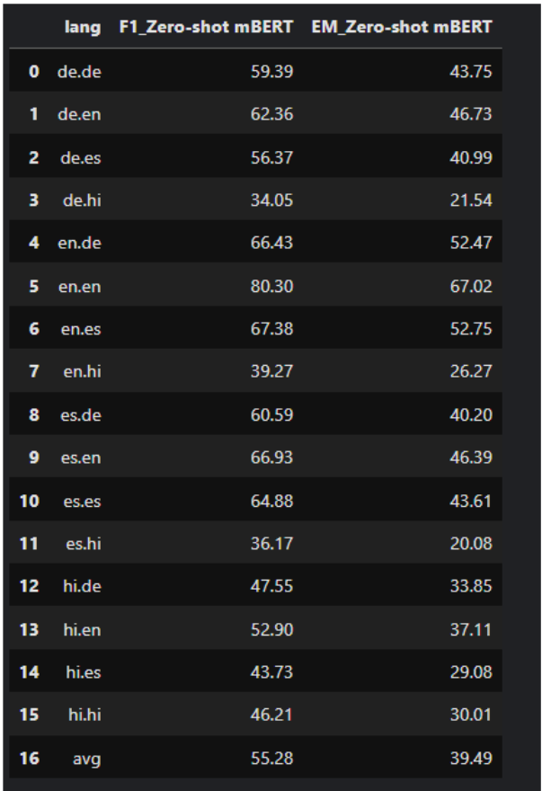
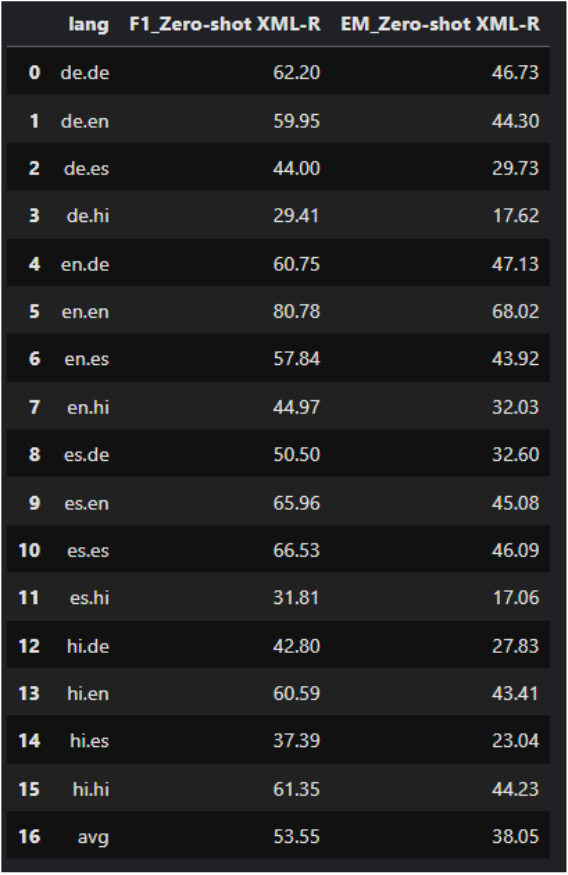
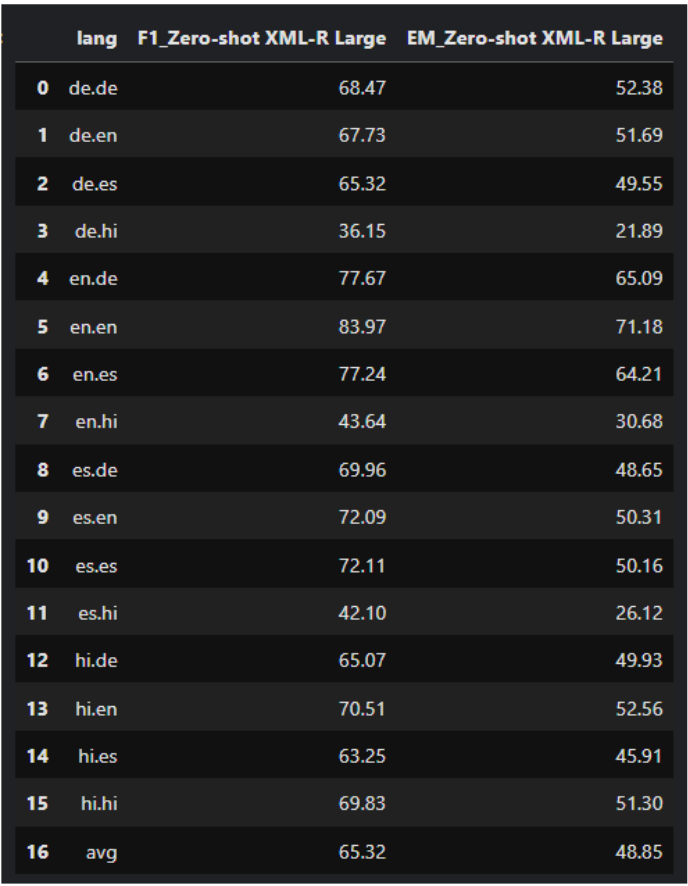

# Cross-Lingual Question Answering with MLQA

## 1. Problem Statement and Motivation

The field of Natural Language Processing (NLP) has seen significant advancements in recent years, particularly in question answering (QA) systems. However, most of these advancements have been primarily focused on English language models. This project aims to address the crucial challenge of cross-lingual question answering, with a specific focus on improving zero-shot transfer between English and two target languages: Spanish and German.

Current state-of-the-art methods, as demonstrated in the MLQA (Multilingual Question
Answering) paper by Lewis et al. (2020), still show a significant performance gap when
compared to training-language performance. This indicates a pressing need for more robust and
effective cross-lingual QA systems that can generalize across languages without requiring
extensive training data in each target language.

By focusing on this problem, we aim to contribute to the development of more linguistically
diverse and globally accessible QA systems, potentially bridging language barriers in
information access and retrieval.

## 2. Project Scope

This project will focus on extractive question answering, where the answer to a given question is
a span within a provided context paragraph. We will explore and implement various approaches
for cross-lingual transfer, building upon and aiming to surpass the baselines established in the
MLQA paper. This project scope includes:

### 2.1. Improved Machine Translation Strategies:
- Explore methods beyond simple back-translation for training data augmentation.
- Investigate advanced techniques for answer span mapping across languages.
- Leverage phrase-based alignment and multilingual sentence embeddings.
### 2.2. Fine-tuning Cross-Lingual Language Models:
- Investigate fine-tuning strategies for pre-trained multilingual language
models, with a focus on XLM-RoBERTa.
- Explore techniques such as adapter modules and cross-lingual knowledge
distillation.

### 2.3. Data Augmentation Techniques:
- Implement various data augmentation methods to improve model robustness
to cross-lingual variations.
- Techniques to be explored include paraphrasing, synonym replacement, and
back-translation using different translation models.

### 2.4. Zero-shot Transfer:
- Focus on improving zero-shot performance from English to Spanish and
German.
- Evaluate the effectiveness of different approaches in a zero-shot setting.

### 2.5. Model Ensemble Techniques:
- Explore ways to combine strengths of different approaches through model
ensembling.

## 3. Datasets Overview

The project leverages two main datasets for model training and evaluation:

### 3.1 MLQA (Multilingual Question Answering)

- A benchmark dataset for evaluating cross-lingual QA systems, encompassing English,
Arabic, German, Spanish, Hindi, Vietnamese, and Simplified Chinese.
- Each QA pair contains a context, question, and corresponding answer span within the
context in the same language.
- Usage in Project: The English portion is used for training, while Spanish and German
portions are utilized for zero-shot evaluation.
- Size: Over 12,000 QA instances in English, with parallel versions in 2-4 additional
languages, totaling over 46,000 QA pairs across languages.

### 3.2 SQuAD 1.1 (Stanford Question Answering Dataset)
- A large-scale English dataset for extractive QA tasks.
- Usage in Project: Used for initial training of the models, as adopted in the baseline
MLQA experiments.
- Size: Over 100,000 question-answer pairs covering 500+ articles.

## 4. Evaluation Methodology

### 4.1 Data Preparation and Tokenization

- **Tokenization Process:** All models employ their respective tokenizers from the
transformer library to process contexts and questions in each language.

- **Truncation and Padding:** Applied uniformly to maintain consistent sequence lengths
across samples for efficient processing.

- **Feature Preparation:** For long contexts, overlapping spans are created, and the start and
end indices of the answer spans are identified to facilitate accurate extraction.

### 4.2 Evaluation Languages

- The project evaluates model performance on both Monolingual pairs like "de.de,"
"en.en," "es.es," "hi.hi" where context and question are in the same language and
Cross-lingual pairs like "de.es," "en.hi," "es.en," "hi.de," etc where context and question
are in the different language.
- **Zero-Shot Performance Testing:** The model's performance is tested in a zero-shot setup
on non-English languages that were unseen during training.

### 4.3 Metrics for Evaluation
The standard evaluation metrics used are:
- **Exact Match (EM):** Measures the percentage of predictions that exactly match the
ground-truth answer span.
- **F1 Score:** Calculates the harmonic mean of precision and recall at the token level,
offering a nuanced evaluation by accounting for partial matches.

## 5. Baseline Models and Evaluation Process

The project evaluates three baseline models to establish performance benchmarks on the MLQA
dataset.

### 5.1 Multilingual BERT (mBERT) Fine-Tuned on SQuAD

- **Model Name:** bert-base-multilingual-cased-finetuned-squad4
 
- **Objective:** Evaluate mBERT’s ability to perform zero-shot QA on non-English
languages.

- **Evaluation Process:**
    - A Trainer object is initialized for evaluation on MLQA, with no additional fine-tuning.
    - The MLQA test data is prepared using prepare_validation_features.
    - **Results Generation:** Predictions are extracted, and the model's performance across languages is stored as a DataFrame.

- **Results Storage:** results_zero_shot_mbert.csv.

### 5.2 XLM-RoBERTa Base Fine-Tuned on SQuAD

- **Model Name:** xlm-roberta-finetuned-squad
- **Objective:** Compare XLM-R’s zero-shot QA performance against mBERT across languages in MLQA.
- **Evaluation Process:**
    - Similar setup as mBERT with a Trainer object.
    - **Results Storage:** The evaluation results are saved in results_zero_shot_xlm_r.csv.

### 5.3 XLM-RoBERTa Large Fine-Tuned on SQuAD

- **Model Name:** xlm-roberta-large_squad
- **Objective:** Compare the performance of the large variant of XLM-RoBERTa against both
the base XLM-R and mBERT to assess the impact of model size.
- **Evaluation Process:**
    - The larger variant is loaded and evaluated on MLQA.
    - **Results Storage:** The results are saved in results_zero_shot_xlm_r_large.csv.

## 6. Results and Analysis

### 6.1 Performance Comparison Across Baselines

- **Metrics Calculation:** For each baseline model, F1 and EM scores are computed across
languages.
- **Result:** The scores are aggregated and stored as CSV files for further analysis:

    - **mBert:** results_zero_shot_mbert.csv
    

    - **XLM-R Base:** results_zero_shot_xlm_r.csv
    

    - **XLM-R Large:** results_zero_shot_xlm_r_large.csv
    

### 6.2 Performance Analysis of Baseline Models

#### 6.2.1. XLM-R Large

- **Monolingual Pairs Performance (F1 & EM Scores):**
    - Generally achieves high scores across monolingual pairs:
        - **en.en:** Highest performance with **F1: 83.97** and **EM: 71.18**. This is
expected as the model is fine-tuned on the English SQuAD dataset.8

        - **Other Monolingual Pairs** (de.de, es.es, hi.hi): Scores are still
high, demonstrating the model's capability in handling extractive QA in
different languages.
            - de.de - **F1: 68.47, EM: 52.38**
            - es.es - **F1: 72.11, EM: 50.16**
            - hi.hi - **F1: 69.83, EM: 51.30**

- **Cross-Lingual Pairs Performance:**
    - Scores drop when the model moves from monolingual pairs to cross-lingual pairs,
indicating the complexity of understanding and transferring information across
languages.
        - **Example Cross-Lingual Pairs:**
            - de.en - **F1: 67.73, EM: 51.69**
            - es.en - **F1: 72.09, EM: 50.31**
            - hi.en - **F1: 70.51, EM: 52.56**

    - The model performs relatively well when the question is in English, as it was
primarily trained on English context-question pairs. However, the scores are
lower than their monolingual counterparts, suggesting the added difficulty in
cross-lingual understanding.

- **Average Performance:**
○ The average F1 and EM scores across all language pairs are **65.32 (F1)** and **48.85
(EM)**, indicating strong overall performance but with room for improvement in
cross-lingual transfer.

#### 6.2.2. XLM-R Base
- **Monolingual Pairs Performance:**
    - Shows moderate performance on monolingual pairs compared to the large variant.
        - en.en achieves the highest F1 and EM scores among monolingual pairs,
as expected:
            **F1: 80.78, EM: 68.02**
        - Performance on other monolingual pairs is comparatively lower:
            de.de - **F1: 62.20, EM: 46.73**
            es.es - **F1: 66.53, EM: 46.09**
            hi.hi - **F1: 61.35, EM: 44.23**

- **Cross-Lingual Pairs Performance:**
    - Cross-lingual pairs experience a noticeable performance drop, highlighting the
difficulties in transferring information across languages.
        - Example Cross-Lingual Pairs:
            - de.en - **F1: 59.95, EM: 44.30**
            - es.en - **F1: 65.96, EM: 45.089**
            - hi.en - **F1: 60.59, EM: 43.41**

    - The model struggles more than XLM-R Large, particularly when dealing with
context in one language and questions in another.
- **Average Performance:**
    - The average F1 and EM scores are 53.55 and 38.05, which are significantly lower
than XLM-R Large. This indicates that while XLM-R Base performs adequately
on monolingual pairs, its performance drops more significantly on cross-lingual
pairs.

### 6.2.3. mBERT (Multilingual BERT)

- **Monolingual Pairs Performance:**
    - mBERT performs relatively well on monolingual pairs but does not match
XLM-R’s performance.
        - en.en: The model achieves its best performance here, as expected from
fine-tuning on SQuAD:
            - **F1: 80.30, EM: 67.02**
        - Scores on other monolingual pairs are moderate:
            - de.de - **F1: 59.39, EM: 43.75**
            - es.es - **F1: 64.88, EM: 43.61**
            - hi.hi - **F1: 46.21, EM: 30.01**

- **Cross-Lingual Pairs Performance:**
    - There is a significant performance drop for cross-lingual pairs, indicating
challenges in transferring QA capabilities across languages:
        - Example Cross-Lingual Pairs:
            de.en - **F1: 62.36, EM: 46.73**
            es.en - **F1: 66.93, EM: 46.39**
            hi.en - **F1: 52.90, EM: 37.11**
    - The drop in performance is more pronounced for non-English contexts (e.g.,
de.es and hi.en), indicating limitations in cross-lingual comprehension.

- **Average Performance:**
    - The average F1 and EM scores for mBERT are **55.28** and **39.49**, respectively,
placing it between XLM-R Large and XLM-R Base in performance. However, the
gap is more pronounced in cross-lingual settings, where mBERT struggles to
handle different language pairs effectively.

## 7. Conclusion

This report provides an overview of the baseline evaluations and the progress made towards
achieving a more effective cross-lingual QA system. The baseline models have been trained and
evaluated on their zero-shot transfer capabilities, and preliminary results have set a benchmark
for further experimentation.

By exploring more advanced techniques in fine-tuning, data augmentation, and model
ensembling, the project aims to improve performance beyond the baselines established in the11
MLQA paper. With consistent monitoring and evaluation, the final model is expected to
demonstrate significant improvements in cross-lingual transfer efficiency for QA tasks.